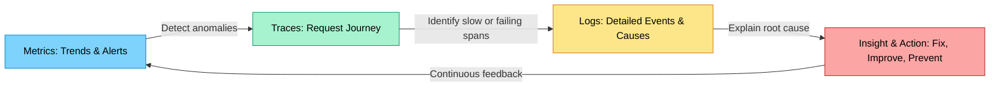
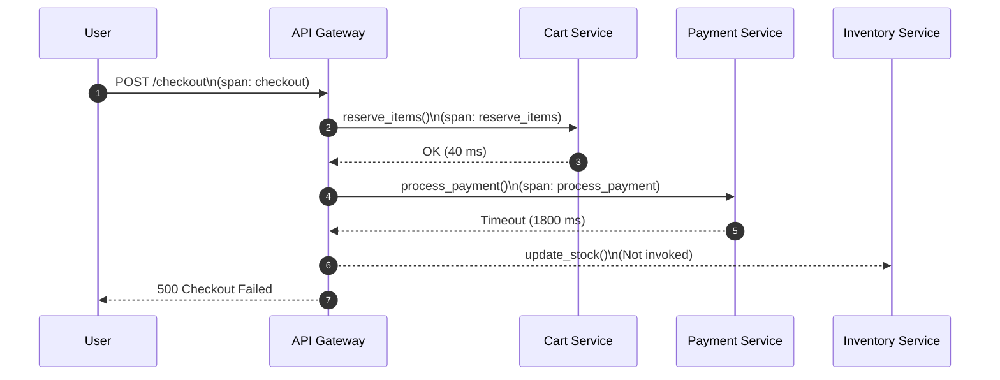

# Chapter 1 – Introduction to Observability

## Introduction

Software systems today are no longer confined to a single process or a single machine. A user’s single click-say, “_Buy Now_” can cascade through dozens of services, threads, APIs, and databases before completing. Each layer introduces its own latency, dependencies, and potential failure points.

When something goes wrong in this web of interactions, our first question is often simple: _What happened_? But in distributed systems, that question rarely has a single answer. One microservice may succeed while another silently fails, leaving only partial breadcrumbs behind. The result is a familiar kind of chaos, where everything looks fine from the outside, until it isn’t.

This is the world where **observability** was born.
Unlike traditional monitoring, which relies on predefined thresholds and known failure modes, observability gives us the tools and data to understand what we didn’t anticipate. It transforms systems from opaque black boxes into transparent, self-describing entities.

In this chapter, we will begin a practical journey through a real-world e-commerce system. We will explore why distributed applications are often difficult to reason about. You will see how traces, logs, and metrics help illuminate their inner workings. Finally, we will look at how OpenTelemetry has become the common foundation for achieving observability across languages and platforms. The examples use Rust for illustration, but the principles apply to any modern, service-oriented architecture.

## Why Observability Matters in Distributed Systems

It’s 10 p.m. on a Friday.
The deployment pipeline shows all green checks. Dashboards are calm. Your shopping-cart system composed of the `cart-service`, `inventory-service`, `payment-service`, and `user-service` has been stable for weeks.

Then, a support ticket appears:

> “Customers are being charged, but their orders are not getting confirmed.”

At first glance, everything looks fine. CPU utilization is low, memory steady, and 200 OK responses dominate the logs. You run another test, the charge succeeds again, but the `orders` table remains empty. Somewhere between `payment` and `cart`, reality diverged.

The team gathers on call. Logs from one service don’t match timestamps from another. You grep through gigabytes of text, SSH into multiple pods, and realize there is **no single thread of truth**. Each microservice recorded its own small truth, unaware of the bigger picture.

When faced with an unknown failure, our survival instinct pushes us toward the familiar. We start debugging, checking metrics, scanning dashboards, and searching through logs, hoping something will reveal the cause. You need the system itself to explain what it just did.

### The Limit of Debugging

Our first instinct when something breaks is to debug. Debugging begins with a hypothesis, an educated guess about where the problem might lie. You trace through the code, add print statements or logs, and test your assumptions step by step, hoping one of them reveals the issue. In a single process or monolithic system, this approach often works. You can reproduce the problem, follow the flow, and isolate the fault.

In a distributed system, that assumption falls apart. There is no single execution thread to follow or shared memory to inspect. The network, message queues, and asynchronous tasks may fail silently, and each service sees only part of the story. When your initial hypothesis fails to reveal the cause, you start again, often repeating the same cycle with growing frustration.

At that point, you turn to metrics, dashboards, and logs, hoping something will reveal the reason behind the failure. You chase symptoms across services, but without correlation, every failure feels like a mystery.

The system behaves like a sealed box. You can observe its symptoms but not its reasoning. That gap between what you can see and why it happens marks the true limit of debugging. It also leads naturally to the next instinct: looking at metrics.

### When Metrics Fall Short

Metrics are often the next instinct after debugging fails. They provide fast, high-level signals such as request counts, error rates, and latency percentiles. These numbers confirm that something is wrong and can help you detect unusual patterns or trends. They are also essential for identifying which service is experiencing a problem.

But metrics cannot explain behavior. They tell you that latency spiked, not why it spiked. They show that error counts increased, not which internal operation caused the increase. Metrics are powerful for detection, but they are limited as diagnostic tools.

Without context or correlation, metrics leave you with the same unanswered question as debugging: what actually happened inside the system?

This limitation pushes you toward the next source of insight: monitoring.

### When Monitoring Reaches Its Limit

When debugging and metrics still fail to give you answers, your next instinct is to turn to monitoring. Monitoring gives you predefined signals such as CPU usage, memory consumption, saturation, and known error conditions. These signals help you watch the boundaries of the system and ensure it remains within safe operating limits.

Monitoring is effective for spotting known issues. It tells you when something crosses a threshold or when a component becomes unhealthy. But it cannot describe relationships between services or explain how a request moved through the system. It alerts you to symptoms, not causes.

Monitoring can tell you that the checkout endpoint has an elevated error rate. It cannot tell you why it happened or where in the request path the failure began.

This is where the shift from monitoring to observability becomes necessary.

### From Guesswork to Understanding

Monitoring collects predefined signals. Observability turns those signals into understanding. It moves you from reacting to symptoms toward interpreting system behavior.

Think of monitoring as installing alarms and observability as installing windows. Alarms tell you something is wrong. Windows let you see what is happening inside.

In the shopping-cart failure, monitoring might show that the checkout error rate surged. Without deeper insight, you fall back on instinct and guesswork to explain why. Observability replaces that uncertainty with evidence. It lets you trace a single request from the API gateway through multiple services and pinpoint where latency or logic diverged.

This deeper visibility does not appear automatically. It must be designed into the system. Each component must emit consistent, correlated signals such as traces, logs, and metrics that describe not only its internal state but also its relationship to other components.

When a system can narrate its own behavior under any condition, even one you never predicted, it becomes observable.

## The Three Pillars of Observability in Action

Every engineering team eventually reaches this point. Dashboards look fine, logs look busy, and yet the truth lies somewhere in between. When debugging and monitoring leave you relying on instinct and guesswork, observability provides the deterministic clarity that instinct cannot.

Observability delivers this clarity through three foundational signals: **traces**, **logs**, and **metrics**. Each replaces assumptions with verifiable data and reveals how the system actually behaves in real time.

Each signal offers a different perspective on the same event:

* **Traces** tell the story of a request as it flows through services.
* **Logs** explain what happened within those services.
* **Metrics** show how often and how severely it happens.

Together, they give you a correlated, end-to-end understanding that moves you from detection to explanation, and eventually, prevention.



### Traces: Following the Request’s Journey

Imagine looking over the shoulder of a single user clicking **Checkout**.

The request begins at the API gateway and moves through the `cart-service`, `inventory-service`, and `payment-service`. In an ideal world, the entire journey completes in under 200 milliseconds. In distributed reality, that journey may branch across threads, network hops, and asynchronous handlers that never line up.

A **trace** captures this journey end to end. It is composed of **spans**, each representing a single operation such as calling a database, making an HTTP request, or executing a function. Each span records metadata such as:

* Start and end timestamps
* Duration
* Status (OK or error)
* Attributes like `service.name`, `operation`, and `user.id`

This structured view makes it possible to follow a request through the system and identify where delays or failures occur.

In our failing checkout example, the trace reveals the story immediately. The payment step takes far too long, causing the gateway to return an error and skip the stock update entirely. To make the sequence clearer, here is a visual representation of the failing request.


The trace pinpoints the issue, a slow operation in the payment service, and shows exactly how it affected the request. It also makes the skipped work obvious. There is no span for update_stock because the call never happened.

Behind the scenes, each span carries a shared **trace ID** that is propagated through HTTP headers using the [**W3C Trace Context**](https://www.w3.org/TR/trace-context/#trace-id). This ensures that whether the call travels between Rust microservices, a Go backend, or a Java API, every service reports its part of the journey in a unified way.

In Rust, crates such as [tracing](https://docs.rs/tracing/latest/tracing/) and [opentelemetry](https://docs.rs/opentelemetry/latest/opentelemetry/) can generate these spans automatically.

```rust
// Use the tracing macro for automatic start/enter/end on function entry/exit
#[tracing::instrument(name = "checkout_request", skip(input))] 
fn checkout_process(input: &CheckoutData) {
    // This entire function scope is now a span. 
    // tracing handles span.enter() and span.end() for you.
    
    // ... call to payment-service (which might start a child span)
}
```
While traces reveal the path a request takes, logs explain what happened inside each step along that path.

### Logs: The Narrative of What Happened

If traces are the system’s *map*, logs are its *journal*.  

Logs describe discrete events such as “Order ID created,” “Token expired,” “Payment gateway timeout.” They hold the fine-grained context you need to answer *why* something failed.

Traditionally, teams logged text lines with inconsistent formats, making correlation nearly impossible. But with modern structured logging and context propagation, logs now participate in the same distributed story as traces.

In Rust, the `tracing` crate integrates this beautifully:

```rust
// Assume this is running inside a span created by #[instrument]
tracing::info!(order_id = %id, user = %user, "payment request started"); 
// The subscriber will automatically attach the trace_id.
```
When exported to a backend like Loki or Elasticsearch, this log carries a `trace_id` and `span_id`. That means a developer inspecting a slow checkout span in a tracing dashboard (like Jaeger or Grafana Tempo) can click directly into the related logs.

Back in our incident, you’d find something like:

```text
[INFO] trace_id=0af76519-8d06-4b31-9dfe-5dfed7e7b3f1 span_id=b9c7a3c4
PaymentService: Error: TokenExpired("Gateway token expired after 10 min TTL")
```
The logs tell the missing story - the service wasn’t broken; the token expired silently due to a misconfigured TTL.
Metrics showed the frequency, traces showed the delay, and logs revealed the cause.

That chain - metrics → traces → logs - is how observability turns raw data into **human insight**.

### Metrics: The Pulse of the System

While traces and logs explain *individual events*, metrics provide the *big picture over time*. They tell you whether your system is healthy, trending toward overload, or degrading quietly.

Metrics are numerical measurements collected continuously, including CPU usage, request counts, error rates, queue lengths, response times. Unlike logs, which are high-volume and detailed, metrics are aggregated and ideal for real-time alerts.

Let’s return to the checkout example. Metrics might show:

* Error rate for /checkout spiking to 12%
* 95th percentile latency rising to 1.9 seconds
* Payment service timeouts increasing sharply

These indicators are your **early-warning system**. They don’t tell you _why_, but they tell you _where_ to look. Once the alert fires, traces and logs help you reconstruct the narrative.

Rust’s [metrics](https://docs.rs/metrics) crate makes this lightweight and composable:

```rust
use metrics::{counter, histogram};

counter!("checkout_requests_total", 1);
histogram!("checkout_latency_seconds", latency);
```
Combined with exporters (Prometheus, OpenTelemetry, or StatsD), these metrics form a continuous pulse of your service.

A healthy observability setup lets you move seamlessly:

1. **Metric alert** → detect abnormal trend
2. **Trace view** → isolate slow or failing service
3. **Logs** → confirm root cause

This triad is what makes distributed debugging _predictable_.

### Bringing It Together

Observability shines when these three signals converge into a unified view. In our shopping-cart story:

* Metrics triggered an alert for high checkout latency.
* Traces pinpointed slow spans in payment-service.
* Logs revealed an expired token error.

The issue wasn’t in networking or database latency; it was a configuration oversight. Without observability, it could have taken hours or even days to root-cause. With observability, it’s minutes.

This pattern is universal across Rust, Go, .NET and other languages. The instrumentation syntax varies, but the philosophy stays the same. Observability empowers engineers to treat production as a **living laboratory**, not a mystery.

### The Shift Toward Unified Standards

Before OpenTelemetry, each signal lived in isolation.
Metrics might come from Prometheus, logs from Fluent Bit, traces from proprietary SDKs. Correlating them required duct tape and luck.

OpenTelemetry changed that.
It unified these signals under one API, one data model, and one context propagation standard - the **W3C Trace Context**. That means your Rust microservice, your Python API, and your Kubernetes ingress can all share the same trace ID, building a coherent narrative across your entire system.

In the next section, we will explore how **OpenTelemetry** provides this foundation. It is an open standard, not a vendor solution, and it enables distributed observability across modern systems.

## OpenTelemetry: The Backbone of Modern Observability

By now, you’ve seen how traces, logs, and metrics together form the foundation of observability. But in most organizations, those signals don’t come from a single system. They come from a _patchwork_ of tools. One team uses Prometheus for metrics, another logs to Loki, and someone else has a tracing setup in Jaeger or Zipkin. Each tool speaks a slightly different language, and none of them agree on what a “trace ID” means.

For years, observability was a collection of _disconnected islands_. That’s where **OpenTelemetry** changed the story.  

OpenTelemetry is not a tool. It is an open-source **standardized framework** of specifications, SDKs, and APIs that describe *how telemetry data is generated, correlated, and exported*. Its goal is simple but powerful:

> “One standard for traces, metrics, and logs - across all languages, all vendors, everywhere.”

It brings consistency, interoperability, and vendor neutrality to observability. Whether you’re using Datadog, Grafana, New Relic, Azure Monitor, or a home-grown backend, OpenTelemetry ensures that your telemetry pipeline stays consistent.

### Why We Needed a Common Standard

Before OpenTelemetry, every telemetry vendor built its own SDKs and wire formats. A trace produced by one system couldn’t be correlated with a log from another. Developers had to manually inject IDs, rewrite exporters, or maintain brittle shims.

For distributed systems written in multiple languages, for example a Rust microservice talking to a Java API, this fragmentation was painful. Each service used different tracing libraries, different propagation headers, and incompatible formats.

The result? A broken story.

Even if every service had “observability,” the _system_ did not.

OpenTelemetry solved this by merging two major projects:

* OpenTracing (focused on tracing APIs)
* OpenCensus (focused on metrics collection and stats aggregation)

Their unification under the Cloud Native Computing Foundation (CNCF) created OpenTelemetry - a single, vendor-neutral, language-agnostic standard that defines how telemetry should be captured and linked together.

Today, OpenTelemetry is one of the most active CNCF projects, second only to Kubernetes in community adoption.

### How OpenTelemetry Works

OpenTelemetry is built around three main components:

1. **APIs and SDKs**
Developers use these to instrument code for traces, metrics, and logs.
In Rust, the official crates are `opentelemetry`, `tracing-opentelemetry`, and `metrics`.
You create spans, counters, and logs using the same unified context.

2. **Context Propagation**
The real magic lies in _propagating context_ - the metadata that links operations together across services.
OpenTelemetry follows the **W3C Trace Context** specification, which defines standardized HTTP headers like:

```text
traceparent: 00-0af76519e8d06b3ffdd9f67a2a5803df-00f067aa0ba902b7-01
tracestate: vendorname=value
```

These headers travel automatically between services, ensuring that a trace started in Rust can continue seamlessly through Go, .NET, or Python components.

3. **Collector and Exporters**
Instead of each app sending data directly to a backend, the **OpenTelemetry Collector** acts as a centralized pipeline.
It receives, processes, batches, and exports telemetry to any destination - Prometheus, Jaeger, Azure Monitor, or others.
This decouples instrumentation from storage and visualization.

Applications can export telemetry directly to a backend or send it through the **OpenTelemetry Collector**. The Collector is optional but offers a centralized pipeline that can receive telemetry from multiple services, perform operations like batching, filtering or sampling, and export the results to backends such as Prometheus, Jaeger, Azure Monitor, or other backends. This design cleanly separates how telemetry is generated from where it is stored or visualized.

### OpenTelemetry in Rust

The Rust ecosystem adopted OpenTelemetry early, with strong support through the `tracing` ecosystem.
Crates like `tracing`, `tracing-subscriber`, and `tracing-opentelemetry` work together to capture structured events, attach context, and export them.
Rust supports OpenTelemetry through two closely related ecosystems. The official OpenTelemetry Rust project provides the API, SDK, and exporters needed to generate and send telemetry data. At the same time, many Rust applications use the Tokio tracing ecosystem for instrumentation. The `tracing`, `tracing-subscriber`, and `tracing-opentelemetry` crates work together to convert tracing spans and events into OpenTelemetry-compliant telemetry, allowing developers to keep using familiar tracing APIs while producing standard OpenTelemetry traces, metrics, and logs.

A minimal example that combines tracing and metrics might look like this:

```rust
fn checkout(order_id: &str) {
    // Spans are created using tracing::info_span! or tracing::span!
    // The tracing-opentelemetry layer converts this into an OTel span.
    let _span = info_span!(Level::INFO, "checkout", order.id = %order_id).entered();

    // Simulated business logic
    process_payment();

    // Record a metric using the global meter
    let meter = global::meter("shop");
    let counter = meter
        .u64_counter("checkout_count")
        .with_description("Counts successful checkouts")
        .init();

    counter.add(
        1,
        &[KeyValue::new("order_id", order_id.to_owned())],
    );
    // <-- _span Drop's here and recorded for export via OpenTelemetry
}
```

In a real system, these spans and counters flow through the OpenTelemetry SDK → Collector → backend (like Azure Monitor or Grafana Tempo).
The trace IDs and metric labels remain consistent across every layer.

This unified context is what turns individual telemetry events into a cohesive narrative, the “_system memory_” you can query, visualize, and reason about.

### The Role of W3C Trace Context

A big reason OpenTelemetry succeeded where earlier efforts struggled is the **W3C Trace Context** standard.
Before it, every tracer used its own header format - `X-B3-TraceId`, `uber-trace-id`, `x-datadog-trace-id`, and so on.

If you’ve ever integrated a Rust microservice with a legacy Java or Node.js backend, you probably saw trace correlation break at the gateway because of mismatched headers.

The W3C Trace Context fixed that by defining a universal format for trace propagation, now supported by browsers, proxies, and major frameworks. It ensures a consistent thread of causality even when the services are written in different languages, owned by different teams, or running on different platforms.

This interoperability is the foundation of modern observability.
Thanks to standards like this, observability has evolved from a set of disconnected tools into a **cohesive discipline**.

### OpenTelemetry in Practice

Returning to our shopping-cart story, here is how OpenTelemetry brings everything together. When a user clicks “Checkout,” the Cart Service starts a new trace. That trace ID flows through HTTP headers to the Payment Service and Inventory Service, allowing their spans and logs to share the same context. Each service also emits metrics that reflect its behavior. An OpenTelemetry Collector can then gather all of this telemetry and forward it to the backend for analysis. In your dashboard, the full picture emerges: the payment latency, the token-expired log entry, and the rising error rate all align under the same operation, giving you a clear and connected view of the failure.

That’s not three tools working in isolation - it’s one cohesive telemetry stream powered by OpenTelemetry.

### Looking Ahead

OpenTelemetry goes beyond troubleshooting. It provides a common foundation for building and sharing observability across services and teams. Instead of relying on separate tools for tracing, logging, and metrics, developers can instrument their systems using a single open standard that works the same way in every language and environment.

For Rust developers, this means observability fits naturally into the ecosystem. Libraries like tracing integrate cleanly with the OpenTelemetry API, allowing spans, events, and context to flow consistently through async code. Metrics and logs follow the same conventions, giving you a unified way to understand how your services behave.

As the OpenTelemetry specification continues to expand to support features like profiling and richer logging, the same foundations you use today will extend to new signals in the future. This creates a long-term path where observability can evolve without forcing you to redesign your instrumentation.

In the next section, we move beyond instrumentation mechanics and look at the cultural side of observability. How teams debug, share knowledge, design features, and respond to failures is shaped by the telemetry their systems emit. Understanding this cultural shift is just as important as understanding traces, logs, and metrics.

## Building an Observability Mindset

When observability first enters a team’s vocabulary, it is often framed as a tooling decision such as which SDK to adopt, which dashboard to use, or which backend offers the best charts. But the real shift comes when observability stops being a **tooling project** and becomes a **thinking habit**.

Observability isn’t just about collecting traces, logs, and metrics; it is about **asking better questions**. In traditional monitoring, engineers look for known symptoms such as high CPU usage, failed health checks, or dropped requests.

In an observable system, engineers explore _unknown behavior_:

* “Why did this request suddenly spike in latency only for one region?”
* “Why do error rates climb when traffic drops?”
* “Why does this service succeed individually but fail in the larger workflow?”

Those questions require curiosity and trust - trust that the system will give you honest answers because you’ve built it to do so.

### From Reactive to Proactive

Without observability, debugging production feels like detective work in the dark. You wait for an alarm, scramble through logs, patch the problem, and hope it doesn’t recur.
With observability, you can see patterns _before_ they cause incidents.

For example, in our shopping-cart system:

* A latency metric shows that checkout time is gradually increasing each day.
* Traces reveal that `inventory-service` requests are queuing longer.
* Logs confirm that a background cleanup job is running too frequently.

Instead of waiting for a customer complaint, the team notices the drift and fixes the configuration proactively. That is the cultural shift observability enables, moving teams toward prevention instead of reaction.

### Observability-Driven Development (ODD)

Just as Test-Driven Development (TDD) encourages writing tests before code, **Observability-Driven Development(ODD)** means designing instrumentation alongside your logic.

When you build a new feature, you also ask:

* What would I need to see if this fails in production?
* What spans, metrics, and logs would help me debug it?
* How can I ensure these signals are consistent with the rest of the system?

In Rust, that could mean adding spans around async boundaries, structured fields to logs, or domain-specific metrics for each business operation. The goal is that every new feature leaves behind a traceable, measurable footprint.

ODD doesn’t slow development; it accelerates understanding. When production issues arise, your code is already instrumented to tell you its story.

### The Human Element

Tools can generate telemetry, but only teams can interpret it.
An observability mindset values **communication** as much as **instrumentation**.

When engineers share dashboards, trace views, and alerts across teams, they build a shared mental model of how the system behaves. Over time, this creates a collective intuition where engineers can anticipate how one change might ripple across services.

This shared context shortens incident response, improves code reviews, and fosters empathy between developers and operators. Observability becomes not just a data layer, but a **language of collaboration**.

### The Broader Impact

As observability matures, it connects deeply with other disciplines:

* **Reliability** - defining Service Level Objectives (SLOs) using metrics.
* **Performance Engineering** - tuning latency using traces and histograms.
* **Security** - tracing suspicious patterns across services.
* **Customer Experience** - linking telemetry to real user behavior.

Each of these areas benefits from a system that can explain itself. Observability, at its core, is about building confidence that your distributed software behaves as intended, and that when it doesn’t, you will know exactly why.

## Chapter Summary

In this chapter, we moved from abstract ideas to a real-world story about a Rust-based shopping-cart system that appeared healthy on dashboards yet silently failed its users. Through that lens, we saw why observability is no longer optional in distributed systems. It is the difference between reacting to symptoms and understanding the causes behind them.

We began by confronting the limits of traditional monitoring, tools that reveal what broke but not why. We then explored the **three pillars of observability** and how each contributes to understanding system behavior.

* **Traces**, which expose the full journey of a request across services;
* **Logs**, which narrate what occurred within each component; and
* **Metrics**, which quantify trends and reveal early signs of drift.

Together, these signals turn raw data into meaningful insight.

We also saw how **OpenTelemetry** unifies these signals under a shared framework.
By aligning traces, logs, and metrics through the **W3C Trace Context**, OpenTelemetry brings cross-language consistency and vendor-neutral observability. This foundation is especially powerful for Rust developers working in heterogeneous environments.

Finally, we explored the **observability mindset** - the cultural shift from firefighting to foresight.
True observability begins when teams design systems that can explain themselves, fostering curiosity, collaboration, and continuous learning.

In the next chapter, we’ll shift our focus inward, exploring what makes Rust uniquely suited for building reliable, observable software.
You’ll learn how Rust’s ownership model, borrowing rules, and lifetimes ensure safety and performance without garbage collection, the same qualities that make it a strong foundation for building resilient systems you can trust and observe with confidence.